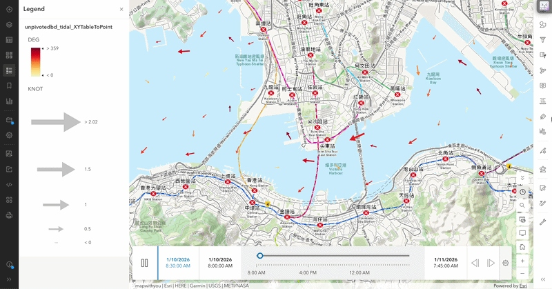
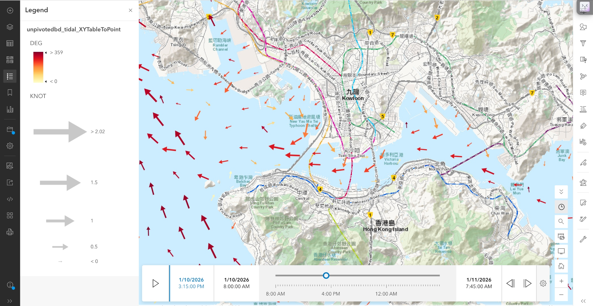
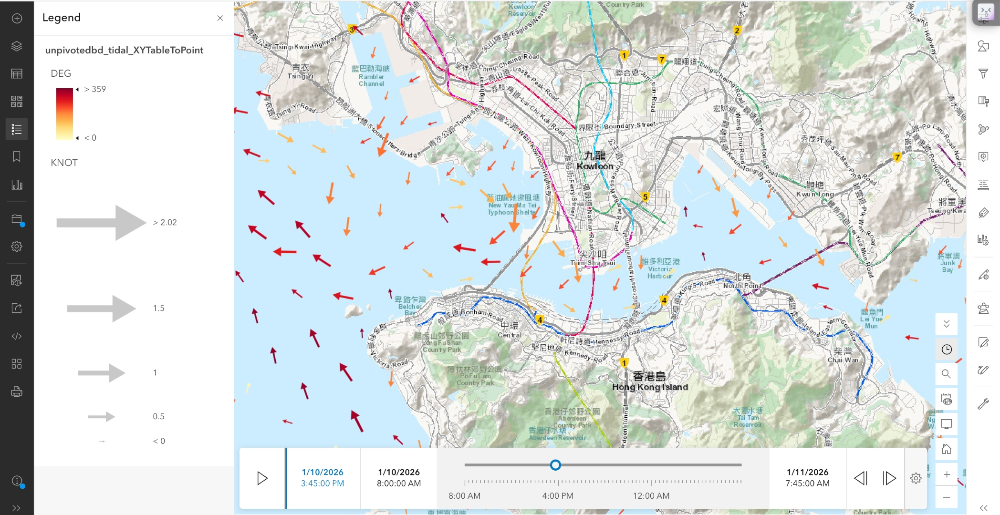
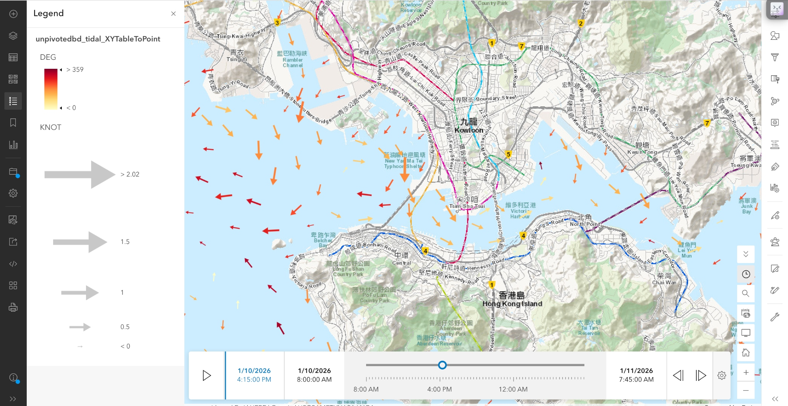

# Hong Kong Digital Tidal Stream Atlas

Interactive GIS atlas for tidal stream visualization in Hong Kong sailing race planning.

**Live map:** [ArcGIS Online map for the January 10 HKRNVR Memorial Vase](https://hkis.maps.arcgis.com/apps/mapviewer/index.html?webmap=9f6f92e652794371b456d7e859ee76d1)

Earlier prototype for the November 1 2025 Class Champs:
[https://www.arcgis.com/apps/mapviewer/index.html?webmap=6ae1dd12d7684ca2b2889210799d1a21](url)

## Project overview

I created this project to make tidal information more accessible and useful for sailing race
planning in Hong Kong. As an experienced sailor and a former member of the Royal Hong
Kong Yacht Club racing team, I wanted to combine sailing with the digital tools we use every
day to address a problem I have seen firsthand: before races, there is often limited time to
complete pre-race checks, assess conditions, and develop an effective race plan.
This project is essentially a more interactive and digitized version of a traditional tidal stream
atlas. Instead of relying only on static tables or printed charts, sailors, coaches and race
managers can use a map-based interface to explore how tidal stream direction and speed
shift across time and location in the race area, making it a more accessible and handy tool
for race use.

## Why it matters

This project was developed for a real sailing use case rather than as a purely academic
exercise. In racing, small differences in current can affect route choice, mark approaches,
starting strategy, and the timing of maneuvers, yet that information is not always easy to
interpret quickly in a practical race setting.
My goal was to create a tool that helps make tidal information more intuitive and more
immediately usable. By turning raw published tidal prediction data into an interactive spatial
interface using GIS, I hoped to build something that could support sailors, coaches, and race
organizers in a more practical way.

## Features

- **Time-enabled tidal visualization:** A time slider animates predicted tidal conditions through the race window.
- **Directional vector mapping:** Each vector shows tidal stream direction.
- **Speed encoding:** Arrow size represents current speed in knots.
- **Color encoding:** Vector color encodes direction in degrees.
- **Clickable inspection:** Users can click individual vectors to inspect coordinates, direction, and speed values.
- **Legend support:** The map includes a legend to help users interpret tidal direction and strength quickly.
- **Operational planning use case:** Built to support sailing race preparation rather than only static analysis.

## Methodology

1. Published tidal prediction data were downloaded from the Hong Kong Tidal Stream Prediction System.
2. The data were cleaned and unpivoted for ArcGIS Pro use.
3. The data were imported into ArcGIS Pro.
4. The dataset was converted into mapped vector features.
5. Time Frame was added to show progressive change in tides per 15 minutes.
6. Symbology was configured to show current direction and current speed visually.
7. The project was published to ArcGIS Online as an interactive web map.

## Interface preview

Additional screenshots from the January 10 race map:

## Repository contents

- `README.md` — public-facing project summary
- `docs/project-overview.pdf` — polished project write-up
- `images/` — screenshots and map interface visuals

## Limitations

This prototype is a tide-based planning and interpretation tool, not a full real-time forecasting system. The current version does not yet incorporate short-term meteorological influences such as wind-driven current changes or a weather-adjusted 96-hour current layer.

## Credits

Developed by **Noah Yiu**.

Special thanks to:

- Ian Fleming, Rear Commodore of the Royal Hong Kong Yacht Club, for project recognition and support
- Prof. LIU Yan, Department of Geography and Resource Management, The Chinese University of Hong Kong, for academic guidance in GIS and spatial thinking
- Adrian Li, team coach

